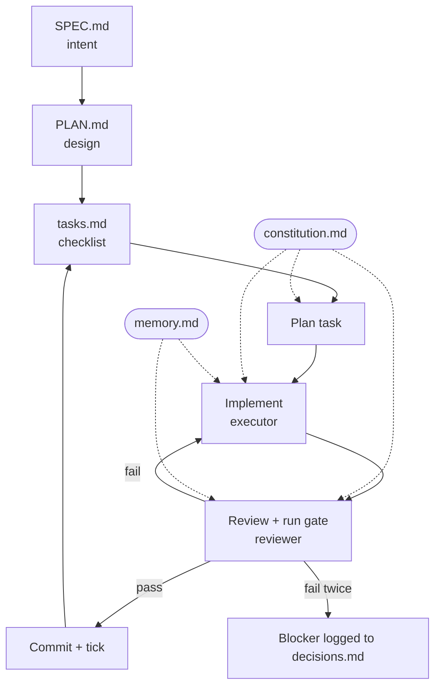

<p align="center">
  
</p>

<h1 align="center">tiny-spec</h1>

<p align="center">A tiny, opinionated take on spec-driven development.</p>

<p align="center">
  <a href="LICENSE"></a>
  <a href="https://docs.claude.com/en/docs/claude-code/overview"></a>
</p>

tiny-spec is a four-step workflow for Claude Code that turns a ticket into shipped,
reviewed code. You write the intent, it produces a design, a task list, and then
builds the work one task at a time. Every task is implemented by one agent and
graded by an independent reviewer that runs the real tests before anything is
committed.

That core is **four skills and two agents**. In front of it sit **two optional
planning on-ramps** — `tiny-spec-prd` (idea → PRD) and `tiny-spec-breakdown`
(PRD → stories) — for when you're starting from an idea rather than a ready ticket.
No orchestrator, no config file, no build step.

```
PLANNING (optional on-ramps)              EXECUTION (the core loop, one story at a time)
  tiny-spec-prd  ⇢  tiny-spec-breakdown ⇢  tiny-spec-create → tiny-spec-plan → tiny-spec-tasks → tiny-spec-build
  idea → PRD        PRD → stories           intent             design           tasks            per-task loop
  PRD.md            BREAKDOWN.md            SPEC.md            PLAN.md +        tasks.md         plan → implement → review → commit
                                                              constitution
```

The two on-ramps are **optional** and stack. Have nothing written down? Run
`tiny-spec-prd` to interview your idea into a `PRD.md`. Have a PRD already? Run
`tiny-spec-breakdown` to carve it into a `BREAKDOWN.md` — a flat list of
Features → Stories with draft acceptance criteria. Have a single known piece of
work? Skip both and start at `tiny-spec-create`. Both on-ramps write a regenerable
file at your project root (not under `.spec/`); `tiny-spec-create` then reads the
breakdown one story at a time.

## New to spec-driven development?

Spec-driven development (SDD) means writing down *what* you want and *why* before
any code exists, then letting that spec drive the build. Instead of prompting an
agent and hoping, you hand it a small, explicit contract — the intent, a design,
and an ordered list of tasks — and it implements against that. The payoff: the
agent stops guessing. It knows what "done" looks like, you can review the plan
before a single line is written, and the result is checked against the spec
rather than vibes. tiny-spec is one small take on that idea.

## Quickstart

Install the skills and agents into your Claude Code config with
[uv](https://docs.astral.sh/uv/):

```sh
uvx tiny-spec install
```

Restart Claude Code so it picks up the new skills, then run the flow in your project:

```
/tiny-spec-prd       # optional: interview a rough idea into a PRD (PRD.md)
/tiny-spec-breakdown # optional: carve a PRD + wireframes into stories (BREAKDOWN.md)
/tiny-spec-create    # capture intent and requirements (binds a ticket, optional)
/tiny-spec-plan      # turn the spec into a design and harden the constitution
/tiny-spec-tasks     # slice the plan into an ordered checklist
/tiny-spec-build     # build each task: implement, review, commit
```

Re-run `install` any time to update; `tiny-spec uninstall` removes only what it
installed. Each skill is copied (not symlinked) so every install is
self-contained.

<details>
<summary>Manual install (no uv)</summary>

The skills and agents are plain markdown — copy them in by hand. Claude Code
loads skills from `~/.claude/skills/` and agents from `~/.claude/agents/`:

```sh
git clone https://github.com/GrayMa77er/tiny-spec.git
cd tiny-spec

mkdir -p "$HOME/.claude/skills" "$HOME/.claude/agents"
for s in tiny-spec-prd tiny-spec-breakdown tiny-spec-create tiny-spec-plan tiny-spec-tasks tiny-spec-build; do
  cp -R "$s" "$HOME/.claude/skills/$s"
done
cp agents/*.md "$HOME/.claude/agents/"
```

If a skill name collides with one you already have, rename these before copying,
or install one set at a time.

</details>

## How it works

The constitution (`constitution.md`) is the spine. `tiny-spec-create` seeds it from a
short interview, `tiny-spec-plan` hardens it with concrete engineering rules, and
`tiny-spec-build` injects it whole into every task. It holds your style, standards,
invariants, definition of done, and verification commands.

`tiny-spec-build` walks the task list top to bottom. Each task runs through one loop:

1. Plan the task against the constitution (inline, brief).
2. Implement it with a fresh `tiny-spec-build-executor` agent.
3. Review it with an independent `tiny-spec-build-reviewer` agent that runs the gate
   end to end and grades against the constitution and the task's acceptance.
4. On pass, commit the code plus a checklist tick. On fail, loop back to the
   executor with the findings. After two failed attempts it becomes a blocker.



Solid arrows are the flow. Dotted arrows show the persistent context injected into
a step: the `constitution.md` goes into planning, implementation, and review, while
`memory.md` is handed to the executor and reviewer.

A small `memory.md` carries operational lessons between runs, so the executor and
reviewer (which start fresh each time) don't relearn the same pitfalls.

When a task can't pass because of a gap in the design or spec, the executor stops
and logs a blocker instead of hacking around it. You fix the gap upstream in
`tiny-spec-plan` or `tiny-spec-create`, then resume. Work runs one ticket at a time and
resumes from the checklist state.

## Why it's small

Most spec frameworks are generous by default:
many phases, many agents, many generated documents. tiny-spec makes the opposite
bet. Keep one safeguard, drop the rest.

A green unit test suite is not the same as working software, so the reviewer
exercises acceptance criteria end to end and a final smoke test confirms the whole
spec. That independent review is the safeguard — not the volume of planning
artifacts. One task, one commit, an external reviewer. Nothing gets added unless
it earns its place.

The case for staying small:

- **Documents are context, and context isn't free.** Generating large `spec.md`,
  `plan.md`, `research.md`, and `data-model.md` files costs tokens to write, then
  costs context to carry. Every paragraph the agent has to hold is room it no
  longer has for your actual code. tiny-spec keeps the spine small — a
  constitution and a short memory — and injects only what each task needs.
- **Real work is a ticket inside a system, not a greenfield repo.** Bigger kits
  assume you're bootstrapping a project from a blank page. Day to day, you pick up
  a ticket and change part of a system that already exists. tiny-spec binds to a
  ticket, works one at a time, and references your task platform instead of
  re-describing the world.
- **Rigid pipelines fight the user.** Mandatory phases and required sections
  impose ceremony on work that doesn't need it. tiny-spec's extra structure is
  optional by design — add shape where it pays, skip it where it doesn't.
- **More moving parts is more to maintain.** Orchestrators, ownership contracts,
  checkpoint matrices, and config files are themselves a system you have to learn
  and keep in sync. A few small skills and two agents are not.
- **Generated docs can fake rigor.** A folder of polished planning artifacts looks
  like progress, but it isn't proof. The proof is the reviewer running your real
  tests before each commit.

That's the whole trade: where larger kits add machinery, tiny-spec adds one
independent reviewer and stops.

## Project layout

Each skill is self-contained. It carries its own templates and refers to them by
relative path, with no absolute paths and no shared parent required at runtime, so
a skill folder works wherever you drop it.

tiny-spec creates a `.spec/` directory in your project root, never inside a skill.
It is namespaced per ticket, with a shared spine at the root:

```
.spec/
  constitution.md           project-wide, shared across tickets
  memory.md                 operational lessons, shared across tickets
  <ticket-id>/              one directory per ticket (PROJ-123/, gh-42/, …)
    SPEC.md  PLAN.md  tasks.md  decisions.md
```

`CONTRACTS.md` documents the formats for maintainers. The skills do not read it at
runtime; each is self-sufficient.

## Integrations

tiny-spec binds to a task platform (Jira, GitHub Issues, Azure DevOps, Monday) by
reference only: a `ticket` block in the spec and a `Refs:` footer on each
[Conventional Commit](https://www.conventionalcommits.org/en/v1.0.0/), so the
platform auto-links the work. No API calls or credentials are required.

## Contributing

Issues and pull requests are welcome. See [CONTRIBUTING.md](CONTRIBUTING.md), and
read [AGENTS.md](AGENTS.md) before changing any skill or agent.

## License

[MIT](LICENSE)
