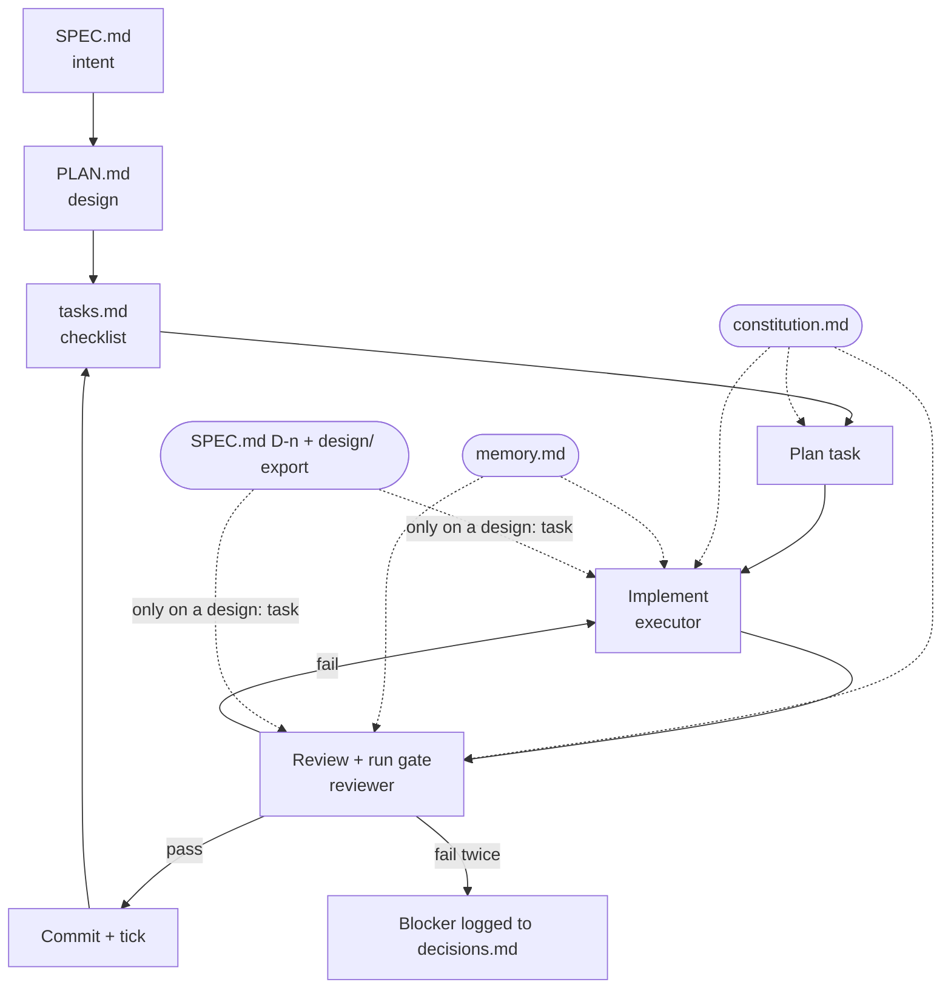

<p align="center">
  
</p>

<h1 align="center">tiny-spec</h1>

<p align="center">A tiny, opinionated take on spec-driven development.</p>

<p align="center">
  <a href="LICENSE"></a>
  <a href="https://docs.claude.com/en/docs/claude-code/overview"></a>
</p>

tiny-spec is a four-step workflow for Claude Code that turns a ticket into shipped,
reviewed code. You write the intent, it produces a design, a task list, and then
builds the work one task at a time. Every task is implemented by one agent and
graded by an independent reviewer that runs the real tests before anything is
committed.

That core is **four skills and two agents**. In front of it sit **two optional
planning on-ramps** — `tiny-spec-prd` (idea → PRD) and `tiny-spec-breakdown`
(PRD → stories) — for when you're starting from an idea rather than a ready ticket.
`tiny-spec-run` walks the three planning steps in one command. No config file, no
build step.

```
                                           ┌───────────────── tiny-spec-run ─────────────────┐
                                           │     optional: one command, stops before build   │
                                           ▼                                                 ▼
PLANNING (optional on-ramps)              EXECUTION (the core loop, one story at a time)
  tiny-spec-prd  ⇢  tiny-spec-breakdown ⇢  tiny-spec-create → tiny-spec-plan → tiny-spec-tasks → tiny-spec-build
  idea → PRD        PRD → stories           intent             design           tasks            per-task loop
  PRD.md            BREAKDOWN.md            SPEC.md            PLAN.md +        tasks.md         plan → implement → review → commit
                                                              constitution
```

The two on-ramps are **optional** and stack. Have nothing written down? Run
`tiny-spec-prd` to interview your idea into a `PRD.md`. Have a PRD already? Run
`tiny-spec-breakdown` to carve it into a `BREAKDOWN.md` — a flat list of
Features → Stories with draft acceptance criteria. Have a single known piece of
work? Skip both and start at `tiny-spec-create`. Both on-ramps write a regenerable
file at your project root (not under `.spec/`); `tiny-spec-create` then reads the
breakdown one story at a time.

## New to spec-driven development?

Spec-driven development (SDD) means writing down *what* you want and *why* before
any code exists, then letting that spec drive the build. Instead of prompting an
agent and hoping, you hand it a small, explicit contract — the intent, a design,
and an ordered list of tasks — and it implements against that. The payoff: the
agent stops guessing. It knows what "done" looks like, you can review the plan
before a single line is written, and the result is checked against the spec
rather than vibes. tiny-spec is one small take on that idea.

## Quickstart

Install the skills and agents into your Claude Code config with
[uv](https://docs.astral.sh/uv/):

```sh
uvx tiny-spec install
```

Restart Claude Code so it picks up the new skills, then run the flow in your project:

```
/tiny-spec-prd       # optional: interview a rough idea into a PRD (PRD.md)
/tiny-spec-breakdown # optional: carve a PRD + wireframes into stories (BREAKDOWN.md)
/tiny-spec-create    # capture intent and requirements (binds a ticket, optional)
/tiny-spec-plan      # turn the spec into a design and harden the constitution
/tiny-spec-tasks     # slice the plan into an ordered checklist
/tiny-spec-build     # build each task: implement, review, commit
```

Or collapse the three planning steps into one and go straight to building:

```
/tiny-spec-run       # create → plan → tasks in one pass; stops before build
/tiny-spec-build     # build each task: implement, review, commit
```

`tiny-spec-run` resolves where your ticket stands and invokes whichever of
`create` / `plan` / `tasks` moves it forward, reconciling anything stale first. It
**stops before `tiny-spec-build`** — that's where you actually review the work — and
it writes nothing itself, it only delegates.

**Building from a mockup?** There is no design flag to pass. Commit your exports to
`design/` before the run and `tiny-spec-create` — whether you invoke it directly or
reach it through `tiny-spec-run` — reads what's there and asks which screens this
ticket covers. [Designs, if you have them](#designs-if-you-have-them) walks through it.

Re-run `install` any time to update; `tiny-spec uninstall` removes only what it
installed. Each skill is copied (not symlinked) so every install is
self-contained.

<details>
<summary>Manual install (no uv)</summary>

The skills and agents are plain markdown — copy them in by hand. Claude Code
loads skills from `~/.claude/skills/` and agents from `~/.claude/agents/`:

```sh
git clone https://github.com/GrayMa77er/tiny-spec.git
cd tiny-spec

mkdir -p "$HOME/.claude/skills" "$HOME/.claude/agents"
for s in tiny-spec-prd tiny-spec-breakdown tiny-spec-run tiny-spec-create tiny-spec-plan tiny-spec-tasks tiny-spec-build; do
  cp -R "$s" "$HOME/.claude/skills/$s"
done
cp agents/*.md "$HOME/.claude/agents/"
```

If a skill name collides with one you already have, rename these before copying,
or install one set at a time.

</details>

## How it works

The constitution (`constitution.md`) is the spine. `tiny-spec-create` seeds it from a
short interview, `tiny-spec-plan` hardens it with concrete engineering rules, and
`tiny-spec-build` injects it whole into every task. It holds your style, standards,
invariants, definition of done, and verification commands.

Because it is project-wide it can also go missing — deleted, or never committed —
while your specs survive. Re-running `tiny-spec-create` then repairs it: it rebuilds
the constitution from whatever is already written down and marks completed tasks
stale, since they were reviewed against a document that wasn't there.

### Designs, if you have them

Wireframes usually get read once and forgotten. tiny-spec turns them into two durable
things — a project-wide token system in the constitution, and a per-screen entry in
the spec — so "does this look right?" becomes something the reviewer can fail a task
on. Skip all of it for a CLI or a library; the constitution simply has no design
section.

**Designs enter by convention, not by argument.** No skill takes a design flag or a
path parameter. `tiny-spec-create` reads every file in `design/` at your project root —
directly, or when `tiny-spec-run` reaches it — and asks which screens this ticket
covers; you can also just hand it paths during the interview. Change an export later and
re-running `create` (or `run`) re-hashes it, marking the spec stale exactly like editing
a requirement.

**1. Commit your exports.** Any format an agent can read — a Figma export, an HTML
mockup, an Excalidraw file, a photo of a whiteboard.

```
your-project/
  design/
    signup.png
    dashboard.png
```

**2. `tiny-spec-create` looks at them and proposes a design system.** Actually looks —
they are read as images. It infers *one* coherent scale across all of them rather than
measuring each screen separately, tells you what it rounded ("your wireframes had 19px
and 21px — proposing `space.5`=20px for both"), and on your approval writes it into
`.spec/constitution.md`:

```markdown
## Design system
- color:  `color.surface.base` #FFFFFF · `color.text.default` #111111
          `color.text.muted` #6B7280 · `color.text.danger` #B91C1C
- space:  `space.1`=4px · `space.2`=8px · `space.4`=16px · `space.6`=24px
- type:   `type.heading.lg` 24px/600/1.25 · `type.body` 16px/400/1.5
          `type.caption` 13px/400/1.4
- states: every interactive surface defines default, focus, disabled, loading, empty, error
```

Since it is project-wide, every screen from here on speaks this vocabulary — and a
redesign edits this one table instead of every file.

**3. Each screen becomes a `D<n>` in `SPEC.md`**, written in those token names:

```markdown
## Design

- D1 — Signup form
  - source: figma.com/file/abc#node-12:34 (view-only)
  - export: design/signup.png
  - sha256: d21d6330648c504edeb924b5398bf7fb6485d3a4c1907e43d800970f39622a1d
  - layout: single centered column, max 420px; title → field → error → submit
  - elements:
    - card    `[data-testid="signup-card"]`   → space.6 padding, color.surface.base
    - title   `[data-testid="signup-title"]`  → type.heading.lg, space.4 below
    - field   `[data-testid="signup-email"]`  → type.body, space.2 below
    - error   `[data-testid="signup-error"]`  → type.caption, color.text.danger
  - states: error (caption under the field), loading (spinner replaces button label)
```

The selectors are a **contract**, not a hint — the reviewer measures exactly these, so
your markup carries them verbatim. Prefer test ids over CSS classes: classes get
renamed by refactors and mangled by CSS-in-JS, and a selector that silently stops
matching is the failure this exists to prevent.

**4. Tag the tasks that build the surface** — and only those, not the API call behind
it. This is your blast radius:

```
- [ ] T4 — Build the signup form
  - acceptance: submitting a valid email advances to the verify step
  - design: D1
```

**5. The reviewer measures it, then looks at it, and fails on both:**

```
DESIGN: D1 — Signup form
  [data-testid="signup-card"]  padding 19px — not on the space.* scale (4/8/16/24)
  [data-testid="signup-email"] MISSING FROM DOM — never built, or renamed
  [data-testid="signup-error"] rgb(204,0,0) — color.text.danger is #B91C1C
  state "loading" never renders: button label stays "Continue", no spinner
  judge: read states default, error — compared against design/signup.png
    state "error": signup-error sits behind the card — every token right, and the
      user sees nothing where the export shows the red caption
    state "default": submit label "Create account" truncates to "Create acco…"
FINDINGS:
- flag: title/field gap feels tight (on-scale — does not fail the task)
```

Numbers first, and never a screenshot diff — pixel comparison goes flaky on font
antialiasing and teams end up muting it. But no measurement catches an element that is
present, on-token, and still not on screen — occluded, clipped, truncated, or the same
color as what's behind it. So the last step reads a screenshot of each state next to
your export and grades presence, legibility, and correspondence. **Where a number
already settled the question the eye may only flag** — on-scale-but-cramped is never a
fail — which keeps the two halves from contradicting each other. Measurable or visible
violations fail; taste comes back as `flag:` notes so a bounded fix loop can't thrash. A
task with no `design:` tag is graded exactly as before.

<details>
<summary>The <code>visual:</code> command (you write this once)</summary>

tiny-spec ships no script — it can't know your stack. Write one, put it in the
constitution's **Verification commands**, and the reviewer runs it:

```
## Verification commands
- test:   `npm test`
- visual: `node visual.mjs`
```

```js
// visual.mjs — node visual.mjs '<selector>' ['<selector>'...]
import { chromium } from 'playwright';

const b = await chromium.launch({ channel: 'chrome' });   // your Chrome, no download
const p = await b.newPage({ viewport: { width: 900, height: 700 } });
await p.goto('http://localhost:3000/signup');             // your dev server + route

for (const sel of process.argv.slice(2)) {
  const el = await p.$(sel);
  if (!el) { console.log(`${sel}\n  MISSING FROM DOM`); continue; }   // required
  console.log(sel, JSON.stringify(await el.evaluate(n => {
    const c = getComputedStyle(n), r = n.getBoundingClientRect();
    return { padding: c.padding, margin: c.margin, fontSize: c.fontSize,
             fontWeight: c.fontWeight, lineHeight: c.lineHeight, color: c.color,
             background: c.backgroundColor, border: c.border,
             opacity: c.opacity, visibility: c.visibility,
             top: Math.round(r.top), w: Math.round(r.width), h: Math.round(r.height) };
  })));
}

const state = process.env.STATE ?? 'default';      // however you drive states
const shot = `/tmp/visual-${state}.png`;
await p.screenshot({ path: shot, fullPage: true });
console.log('SCREENSHOT', state, shot);            // this line arms the judge

await b.close();
```

The missing-selector branch **must print something** — that is what turns a renamed
element into a failure instead of a silent skip. `top` is what the layout-order check
reads, and `opacity`/`visibility` are worth printing because they turn the cheapest kind
of invisible element into a numeric failure. The `SCREENSHOT` line is what the reviewer
reads back to look at the render and catch the rest — occlusion, clipping, truncation,
same-color-on-same-color — none of which any single property reports. Drop it and the
numeric half still gates exactly as before, with the reviewer reporting `judge: not run`
rather than quietly skipping it. Without a `visual:` command at all, a task tagged
`design:` raises a blocker rather than passing quietly.

</details>

**No Figma token, plugin, or design SaaS.** A view-only account works fine: the
committed export is what the agents read, and `source:` keeps the trail back. Change
an export and its recorded `sha256` stops matching, which marks the spec stale exactly
like editing a requirement — so a design that moved under finished work can't pass
unnoticed.

`tiny-spec-build` walks the task list top to bottom. Each task runs through one loop:

1. Plan the task against the constitution (inline, brief).
2. Implement it with a fresh `tiny-spec-build-executor` agent.
3. Review it with an independent `tiny-spec-build-reviewer` agent that runs the gate
   end to end and grades against the constitution and the task's acceptance.
4. On pass, commit the code plus a checklist tick. On fail, loop back to the
   executor with the findings. After two failed attempts it becomes a blocker.


```mermaid
flowchart TB
    SPEC[SPEC.md<br/>intent] --> PLAN[PLAN.md<br/>design] --> TASKS[tasks.md<br/>checklist]

    TASKS --> P[Plan task]
    P --> I[Implement<br/>executor]
    I --> R[Review + run gate<br/>reviewer]
    R -->|pass| C[Commit + tick]
    C --> TASKS
    R -->|fail| I
    R -->|fail twice| B[Blocker logged to decisions.md]

    CON([constitution.md]) -.-> P & I & R
    MEM([memory.md]) -.-> I & R
    DES([SPEC.md D-n + design/ export]) -.->|only on a design: task| I & R
```

Solid arrows are the flow. Dotted arrows show the persistent context injected into
a step: the `constitution.md` goes into planning, implementation, and review, while
`memory.md` is handed to the executor and reviewer. A task tagged `design:` also
carries its screen's `D<n>` entry into both agents — and the review step then runs
the `visual:` gate on top of the usual one.

A small `memory.md` carries operational lessons between runs, so the executor and
reviewer (which start fresh each time) don't relearn the same pitfalls.

When a task can't pass because of a gap in the design or spec, the executor stops
and logs a blocker instead of hacking around it. You fix the gap upstream in
`tiny-spec-plan` or `tiny-spec-create`, then resume. Work runs one ticket at a time and
resumes from the checklist state.

## Why it's small

Most spec frameworks are generous by default:
many phases, many agents, many generated documents. tiny-spec makes the opposite
bet. Keep one safeguard, drop the rest.

A green unit test suite is not the same as working software, so the reviewer
exercises acceptance criteria end to end and a final smoke test confirms the whole
spec. That independent review is the safeguard — not the volume of planning
artifacts. One task, one commit, an external reviewer. Nothing gets added unless
it earns its place.

The case for staying small:

- **Documents are context, and context isn't free.** Generating large `spec.md`,
  `plan.md`, `research.md`, and `data-model.md` files costs tokens to write, then
  costs context to carry. Every paragraph the agent has to hold is room it no
  longer has for your actual code. tiny-spec keeps the spine small — a
  constitution and a short memory — and injects only what each task needs.
- **Real work is a ticket inside a system, not a greenfield repo.** Bigger kits
  assume you're bootstrapping a project from a blank page. Day to day, you pick up
  a ticket and change part of a system that already exists. tiny-spec binds to a
  ticket, works one at a time, and references your task platform instead of
  re-describing the world.
- **Rigid pipelines fight the user.** Mandatory phases and required sections
  impose ceremony on work that doesn't need it. tiny-spec's extra structure is
  optional by design — add shape where it pays, skip it where it doesn't.
- **More moving parts is more to maintain.** Orchestrators, ownership contracts,
  checkpoint matrices, and config files are themselves a system you have to learn
  and keep in sync. A few small skills and two agents are not.
- **Generated docs can fake rigor.** A folder of polished planning artifacts looks
  like progress, but it isn't proof. The proof is the reviewer running your real
  tests before each commit.

That's the whole trade: where larger kits add machinery, tiny-spec adds one
independent reviewer and stops.

## Project layout

Each skill is one self-contained `SKILL.md`, with every document skeleton inline in
it — no companion template files, no absolute paths, and no shared parent required
at runtime, so a skill works wherever you drop it. (It also means a run never stops
to ask permission to read a template out of your Claude config directory.)

tiny-spec creates a `.spec/` directory in your project root, never inside a skill.
It is namespaced per ticket, with a shared spine at the root:

```
.spec/
  constitution.md           project-wide, shared across tickets
  memory.md                 operational lessons, shared across tickets
  <ticket-id>/              one directory per ticket (PROJ-123/, gh-42/, …)
    SPEC.md  PLAN.md  tasks.md  decisions.md
```

`PRD.md`, `BREAKDOWN.md`, and `design/` sit at your project root rather than inside
`.spec/`, because they are yours: the first two are regenerable pre-spec planning
files, and the design exports are project files no skill ever writes.

`CONTRACTS.md` documents the formats for maintainers. The skills do not read it at
runtime; each is self-sufficient.

## Integrations

tiny-spec binds to a task platform (Jira, GitHub Issues, Azure DevOps, Monday) by
reference only: a `ticket` block in the spec and a `Refs:` footer on each
[Conventional Commit](https://www.conventionalcommits.org/en/v1.0.0/), so the
platform auto-links the work. No API calls or credentials are required.

## Contributing

Issues and pull requests are welcome. See [CONTRIBUTING.md](CONTRIBUTING.md), and
read [AGENTS.md](AGENTS.md) before changing any skill or agent.

## License

[MIT](LICENSE)
