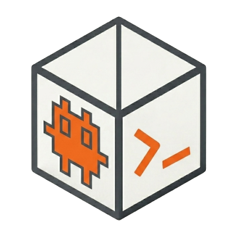
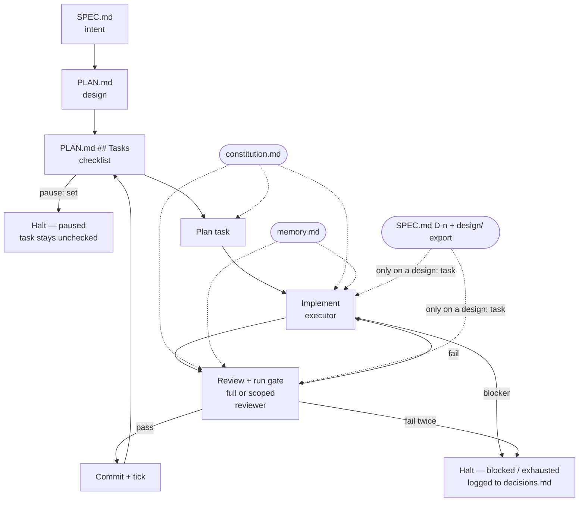

<p align="center">
  
</p>

<h1 align="center">tiny-spec</h1>

<p align="center">A tiny, opinionated take on spec-driven development.</p>

<p align="center">
  <a href="https://pypi.org/project/tiny-spec/"></a>
  <a href="https://pypi.org/project/tiny-spec/"></a>
  <a href="LICENSE"></a>
  <a href="https://docs.claude.com/en/docs/claude-code/overview"></a>
  <a href="https://github.com/GrayMa77er/tiny-spec/stargazers"></a>
</p>

<p align="center">
  <code>uvx tiny-spec install</code>
</p>

<!-- DEMO GIF SLOT — images/demo.gif
     Record the FAIL -> fix -> PASS loop, then uncomment:
<p align="center">
  
</p>
-->

tiny-spec is a four-step workflow for Claude Code that turns a ticket into shipped,
reviewed code. You write the intent, it produces a design, a task list, and then
builds the work one task at a time. Every task is implemented by one agent and
graded by an independent reviewer that runs the real tests before anything is
committed.

That core is **three skills and two agents**. In front of it sit **two front doors** —
pick the one that matches where you're starting. Over the top sits **one router**,
`tiny-spec-run`, which drives the chain and, when you ask it to, works a whole list of
features through to merged code. No config file, no build step.

```
   GREENFIELD                        BROWNFIELD
   starting from an idea             starting from a codebase
   tiny-spec-scope                   tiny-spec-adopt
   idea → Features                   real code → constitution
   BREAKDOWN.md                      constitution.md
            \                         /
             └───────────┬───────────┘
                         ▼
   tiny-spec-create  →  tiny-spec-plan  →  tiny-spec-build
   intent               design + tasks      per-task loop
   SPEC.md              PLAN.md             plan → implement
                        (+ ## Tasks)        → review → commit

   tiny-spec-run      one router. Walks the chain and stops before build —
                      or, asked to, builds each feature and merges it.
   tiny-spec-design   optional. Wireframes → tokens + gradeable screens.
```

**Pick one front door, once per project.** Starting from an idea with no code yet? Run
`tiny-spec-scope` — it interviews the idea into a `BREAKDOWN.md`, a flat list of
well-defined Features with draft acceptance criteria. Working in a codebase that already
exists? Run `tiny-spec-adopt` — it reads your repo and derives the constitution from
what's actually there: your real lint and test commands, your real layout, your real
conventions. Have a single known ticket in a project that's already set up? Skip both
and start at `tiny-spec-create`.

Neither builds anything. They set the project up so the three core skills have
something true to work from, and both write a regenerable file you can edit freely.

## How small

Every other kit in this space is bigger. That is the whole pitch, so here is the
receipt rather than the adjective:

| | skills / commands | agents | config | artifacts per feature |
|---|---|---|---|---|
| **tiny-spec** | **7** (3 core + 1 router + 3 optional) | **2** | **none** | **`SPEC` `PLAN`** |
| [GitHub Spec Kit](https://github.com/github/spec-kit) | 10 | — | `specify init` | `spec` `plan` `tasks` `checklist` `constitution` `research` `data-model` `contracts/` `quickstart` |
| [OpenSpec](https://github.com/Fission-AI/OpenSpec) | 12 | — | `.openspec.yaml` | `proposal` `design` `tasks` `specs/` |
| [BMAD-METHOD](https://github.com/bmad-code-org/BMAD-METHOD) | 58 | 5 personas | 35 × `customize.toml` | `PRD` `architecture` `epics` `stories` `UX` `brief` `sprint-plan` |

The whole of tiny-spec is **2,195 lines** of markdown across 7 skills and 2 agents. No
config file, no build step, no orchestrator, no CLI to initialize a project — the skills
are the product.

<sub>Counted on 2026-08-03 from each project's own repository, not its marketing copy —
Spec Kit's `templates/commands/`, OpenSpec's `skills/`, BMAD's `SKILL.md` and
`customize.toml` files on `main`. All three are far more popular than tiny-spec, and
being smaller is a bet, not a proof of quality — re-run the counts yourself before
believing them.</sub>

## Why it's small

Most spec frameworks are generous by default: many phases, many agents, many generated
documents. tiny-spec makes the opposite bet — keep one safeguard, drop the rest. That
safeguard is the independent reviewer, which exercises acceptance criteria end to end,
because a green unit test suite is not the same as working software.

The case for staying small:

- **Documents are context, and context isn't free.** Every paragraph the agent has to
  hold is room it no longer has for your actual code. tiny-spec keeps the spine small —
  a constitution and a short memory — and injects only what each task needs.
- **Real work is a ticket inside a system, not a greenfield repo.** tiny-spec binds to a
  ticket and references your task platform instead of re-describing the world.
- **Rigid pipelines fight the user.** Mandatory phases impose ceremony on work that
  doesn't need it. The extra structure here is optional — add shape where it pays.
- **More moving parts is more to maintain.** Orchestrators, ownership contracts, and
  config files are themselves a system you have to keep in sync. Two agents are not.
- **Generated docs can fake rigor.** A folder of polished planning artifacts looks like
  progress, but the proof is the reviewer running your real tests before each commit.

That's the whole trade: where larger kits add machinery, tiny-spec adds one
independent reviewer and stops.

### Does the trade hold up?

Smaller is easy to claim, so the suite ships a harness that measures it. `docs/eval/`
runs tiny-spec headlessly on benchmark tasks in hermetic sandboxes, grades the produced
code with held-out tests the suite never sees, and checks the reviewer's own verdict
against that ground truth. The number that matters is **false-PASS rate** — how often
the gate blesses code that is actually broken.

Most recent run — 5 benchmark tasks on v1.0.0:

| | |
|---|---|
| held-out pass rate | **100%** (5/5) — the code works, judged by tests it never saw |
| suite/truth agreement | **100%** — the reviewer's verdict matched the held-out grader every time |
| **false-PASS rate** | **0%** — it never called broken code done |
| blocker rate | 0% |

Two earlier versions scored identically, which is the more interesting result: the loop
is stable across releases rather than tuned to one commit — including through 1.0, which
rebuilt the planning chain underneath it.

See [`docs/eval/README.md`](docs/eval/README.md) for the method and
[`docs/sdd-evaluation-rubric.md`](docs/sdd-evaluation-rubric.md) for the rubric. **Read
both skeptically: it is my benchmark, of my own tool, scored by me**, on small
self-contained tasks — so it measures the loop on well-specified work, not
large-codebase performance. The harness is in the repo so you don't have to take my
word for it.

## New to spec-driven development?

Spec-driven development (SDD) means writing down *what* you want and *why* before any
code exists, then letting that spec drive the build. Instead of prompting an agent and
hoping, you hand it a small, explicit contract — the intent, a design, and an ordered
list of tasks. The payoff: the agent stops guessing, you review the plan before a line
is written, and the result is checked against the spec rather than vibes.

## Quickstart

Install the skills and agents into your Claude Code config with
[uv](https://docs.astral.sh/uv/):

```sh
uvx tiny-spec install
```

Restart Claude Code so it picks up the new skills, then run the flow in your project:

```
/tiny-spec-scope     # starting from an idea: interview it into features (BREAKDOWN.md)
/tiny-spec-adopt     # starting from a codebase: derive the constitution from real code
/tiny-spec-create    # capture intent and requirements (binds a ticket, optional)
/tiny-spec-plan      # design it, harden the constitution, slice the task list
/tiny-spec-build     # build each task: implement, review, commit
```

Run one of the two front doors once per project, then `create → plan → build` per
ticket. Or let the router drive:

```
/tiny-spec-run       # walks the chain, reconciling anything stale; stops before build
/tiny-spec-build     # build each task: implement, review, commit
```

`tiny-spec-run` resolves where your work stands and invokes whichever skill moves it
forward. It writes nothing itself, it only delegates. By default it **stops before
`tiny-spec-build`** — that's where you actually review the work.

Ask it to build and it goes all the way instead:

```
/tiny-spec-run build the backlog     # per feature: branch → plan → build → merge → next
```

It reads your `BREAKDOWN.md` (or a list you paste) and works the features one after
another, merging each finished branch into `main` locally before starting the next —
until it's done or reaches a **terminal state** it names out loud. See
[Working a whole list](#working-a-whole-list). Which of the two it does is decided from
your opening request and **never changes mid-run** — a run you started as "get it
ready" will not talk itself into building.

**Building from a mockup?** Run `/tiny-spec-design` after `create`. Commit your exports
to `design/` first; it reads what's there and asks which screens this ticket covers.
[Designs, if you have them](#designs-if-you-have-them) walks through it.

Re-run `install` any time to update; `tiny-spec uninstall` removes only what it
installed. Each skill is copied (not symlinked) so every install is
self-contained.

<details>
<summary>Manual install (no uv)</summary>

The skills and agents are plain markdown — copy them in by hand. Claude Code
loads skills from `~/.claude/skills/` and agents from `~/.claude/agents/`:

```sh
git clone https://github.com/GrayMa77er/tiny-spec.git
cd tiny-spec

mkdir -p "$HOME/.claude/skills" "$HOME/.claude/agents"
for s in tiny-spec-scope tiny-spec-adopt tiny-spec-run tiny-spec-create tiny-spec-design tiny-spec-plan tiny-spec-build; do
  cp -R "$s" "$HOME/.claude/skills/$s"
done
cp agents/*.md "$HOME/.claude/agents/"
```

If a skill name collides with one you already have, rename these before copying,
or install one set at a time.

</details>

### See a finished run first

[`examples/todo-cli/`](examples/todo-cli/) is a real run of the flow on one small
ticket, committed verbatim — the `TICKET.md` that went in, the `SPEC.md`, `PLAN.md`
and `constitution.md` the suite wrote, and the code and tests it produced.
The tests pass; you can clone it and run the gate yourself.

## How it works

The constitution (`constitution.md`) is the spine. `tiny-spec-adopt` derives it from
your codebase, or `tiny-spec-create` seeds it from a short interview; `tiny-spec-plan`
hardens it with concrete engineering rules, and `tiny-spec-build` injects it whole into
every task. It holds your style, standards, invariants, definition of done, and
verification commands.

**On an existing codebase, deriving beats asking.** Your test command, layout, and
conventions are already written down — in `package.json`, in CI, in your linter config,
in the shape of the tree. `tiny-spec-adopt` reads them, marks each section as declared
or inferred so you know which parts to distrust, then *runs* the verification commands
it derived and reports which went green. A gate that has never been run turns every
future review into theatre.

Because it is project-wide the constitution can also go missing — deleted, or never
committed — while your specs survive. Re-running `tiny-spec-adopt` (or
`tiny-spec-create`, on a project with no code yet) repairs it, and marks completed tasks
stale, since they were reviewed against a document that wasn't there.

### Designs, if you have them

Wireframes usually get read once and forgotten. tiny-spec turns them into two durable
things — a project-wide token system in the constitution, and a per-screen entry in
the spec — so "does this look right?" becomes something the reviewer can fail a task
on. Skip all of it for a CLI or a library; the constitution simply has no design
section.

**Designs enter by convention, not by argument.** No skill takes a design flag or a
path parameter. `tiny-spec-design` reads every file in `design/` at your project root
and asks which screens this ticket covers; you can also just hand it paths. Change an
export later and `tiny-spec-run` notices — it re-hashes every anchored export on its way
down the chain, and routes a mismatch back to `tiny-spec-design`, marking the spec stale
exactly like editing a requirement.

**1. Commit your exports.** Any format an agent can read — a Figma export, an HTML
mockup, an Excalidraw file, a photo of a whiteboard.

```
your-project/
  design/
    signup.png
    dashboard.png
```

**2. `tiny-spec-design` looks at them and proposes a design system.** Actually looks —
they are read as images. It infers *one* coherent scale across all of them rather than
measuring each screen separately, tells you what it rounded ("your wireframes had 19px
and 21px — proposing `space.5`=20px for both"), and on your approval writes it into
`.spec/constitution.md`:

```markdown
## Design system
- color:  `color.surface.base` #FFFFFF · `color.text.default` #111111
          `color.text.muted` #6B7280 · `color.text.danger` #B91C1C
- space:  `space.1`=4px · `space.2`=8px · `space.4`=16px · `space.6`=24px
- type:   `type.heading.lg` 24px/600/1.25 · `type.body` 16px/400/1.5
          `type.caption` 13px/400/1.4
- states: every interactive surface defines default, focus, disabled, loading, empty, error
```

Since it is project-wide, every screen from here on speaks this vocabulary — and a
redesign edits this one table instead of every file.

**3. Each screen becomes a `D<n>` in `SPEC.md`**, written in those token names:

```markdown
## Design

- D1 — Signup form
  - source: figma.com/file/abc#node-12:34 (view-only)
  - export: design/signup.png
  - sha256: d21d6330648c504edeb924b5398bf7fb6485d3a4c1907e43d800970f39622a1d
  - layout: single centered column, max 420px; title → field → error → submit
  - elements:
    - card    `[data-testid="signup-card"]`   → space.6 padding, color.surface.base
    - title   `[data-testid="signup-title"]`  → type.heading.lg, space.4 below
    - field   `[data-testid="signup-email"]`  → type.body, space.2 below
    - error   `[data-testid="signup-error"]`  → type.caption, color.text.danger
  - states: error (caption under the field), loading (spinner replaces button label)
```

The selectors are a **contract**, not a hint — the reviewer measures exactly these, so
your markup carries them verbatim. Prefer test ids over CSS classes: classes get
renamed by refactors and mangled by CSS-in-JS, and a selector that silently stops
matching is the failure this exists to prevent.

**4. Tag the tasks that build the surface** — and only those, not the API call behind
it. This is your blast radius:

```
- [ ] T4 — Build the signup form
  - acceptance: submitting a valid email advances to the verify step
  - design: D1
```

**5. The reviewer measures it, then looks at it, and fails on both:**

```
DESIGN: D1 — Signup form
  [data-testid="signup-card"]  padding 19px — not on the space.* scale (4/8/16/24)
  [data-testid="signup-email"] MISSING FROM DOM — never built, or renamed
  [data-testid="signup-error"] rgb(204,0,0) — color.text.danger is #B91C1C
  state "loading" never renders: button label stays "Continue", no spinner
  judge: read states default, error — compared against design/signup.png
    state "error": signup-error sits behind the card — every token right, and the
      user sees nothing where the export shows the red caption
    state "default": submit label "Create account" truncates to "Create acco…"
FINDINGS:
- flag: title/field gap feels tight (on-scale — does not fail the task)
```

Numbers first, and never a screenshot diff — pixel comparison goes flaky on font
antialiasing and teams end up muting it. But no measurement catches an element that is
present, on-token, and still not on screen: occluded, clipped, truncated, or the same
color as what's behind it. So the last step reads a screenshot of each state next to
your export and grades presence, legibility, and correspondence. **Where a number
already settled the question the eye may only flag**, which keeps the two halves from
contradicting each other — measurable or visible violations fail, taste comes back as
`flag:` notes. A task with no `design:` tag is graded exactly as before.

<details>
<summary>The <code>visual:</code> command (you write this once)</summary>

tiny-spec ships no script — it can't know your stack. Write one, put it in the
constitution's **Verification commands**, and the reviewer runs it:

```
## Verification commands
- test:   `npm test`
- visual: `node visual.mjs`
```

```js
// visual.mjs — node visual.mjs '<selector>' ['<selector>'...]
import { chromium } from 'playwright';

const b = await chromium.launch({ channel: 'chrome' });   // your Chrome, no download
const p = await b.newPage({ viewport: { width: 900, height: 700 } });
await p.goto('http://localhost:3000/signup');             // your dev server + route

for (const sel of process.argv.slice(2)) {
  const el = await p.$(sel);
  if (!el) { console.log(`${sel}\n  MISSING FROM DOM`); continue; }   // required
  console.log(sel, JSON.stringify(await el.evaluate(n => {
    const c = getComputedStyle(n), r = n.getBoundingClientRect();
    return { padding: c.padding, margin: c.margin, fontSize: c.fontSize,
             fontWeight: c.fontWeight, lineHeight: c.lineHeight, color: c.color,
             background: c.backgroundColor, border: c.border,
             opacity: c.opacity, visibility: c.visibility,
             top: Math.round(r.top), w: Math.round(r.width), h: Math.round(r.height) };
  })));
}

const state = process.env.STATE ?? 'default';      // however you drive states
const shot = `/tmp/visual-${state}.png`;
await p.screenshot({ path: shot, fullPage: true });
console.log('SCREENSHOT', state, shot);            // this line arms the judge

await b.close();
```

The missing-selector branch **must print something** — that is what turns a renamed
element into a failure instead of a silent skip. `top` feeds the layout-order check, and
`opacity`/`visibility` turn the cheapest kind of invisible element into a numeric
failure. The `SCREENSHOT` line arms the judge; drop it and the numeric half still gates
exactly as before, with the reviewer reporting `judge: not run` rather than quietly
skipping it. Without a `visual:` command at all, a task tagged `design:` raises a
blocker rather than passing quietly.

</details>

**No Figma token, plugin, or design SaaS.** A view-only account works fine: the
committed export is what the agents read, and `source:` keeps the trail back. Change
an export and its recorded `sha256` stops matching, which marks the spec stale exactly
like editing a requirement — so a design that moved under finished work can't pass
unnoticed.

`tiny-spec-build` walks the task list top to bottom. Each task runs through one loop:

1. Plan the task against the constitution (inline, brief).
2. Implement it with a fresh `tiny-spec-build-executor` agent.
3. Review it with an independent `tiny-spec-build-reviewer` agent that runs the gate
   and grades against the constitution and the task's acceptance.
4. On pass, commit the code plus a checklist tick. On fail, loop back to the
   executor with the findings. After two failed attempts the run halts `exhausted`.

Every task's acceptance is exercised end to end, black-box, by the reviewer — that part
never varies. What does vary is how much of the toolchain gets re-proven around it: a
clean `install → build` runs on the first task, the last one, anything touching
dependency or build config, and anything carrying `design:`; in between the reviewer runs
lint and tests against the existing build. It escalates back to the full gate whenever the
narrower one can't carry the verdict, and the authoritative clean run happens once more
over the whole project as the final smoke. Re-installing from scratch on every task
proved the same thing repeatedly and was the slowest part of the loop.


```mermaid
flowchart TB
    SPEC[SPEC.md<br/>intent] --> PLAN[PLAN.md<br/>design] --> TASKS[PLAN.md ## Tasks<br/>checklist]

    TASKS -->|pause: set| H[Halt — paused<br/>task stays unchecked]
    TASKS --> P[Plan task]
    P --> I[Implement<br/>executor]
    I --> R[Review + run gate<br/>full or scoped<br/>reviewer]
    I -->|blocker| B
    R -->|pass| C[Commit + tick]
    C --> TASKS
    R -->|fail| I
    R -->|fail twice| B[Halt — blocked / exhausted<br/>logged to decisions.md]

    CON([constitution.md]) -.-> P & I & R
    MEM([memory.md]) -.-> I & R
    DES([SPEC.md D-n + design/ export]) -.->|only on a design: task| I & R
```

Solid arrows are the flow. Dotted arrows show the persistent context injected into
a step: the `constitution.md` goes into planning, implementation, and review, while
`memory.md` is handed to the executor and reviewer. A task tagged `design:` also
carries its screen's `D<n>` entry into both agents — and the review step then runs
the `visual:` gate on top of the usual one.

A small `memory.md` carries operational lessons between runs, so the executor and
reviewer (which start fresh each time) don't relearn the same pitfalls.

When a task can't pass because of a gap in the design or spec, the executor stops
and logs a blocker instead of hacking around it. You fix the gap upstream in
`tiny-spec-plan` or `tiny-spec-create`, then resume. Work runs one ticket at a time and
resumes from the checklist state.

### Working a whole list

Ask `/tiny-spec-run` to build — "build the backlog", "work through the breakdown",
"spec it out and build it" — and it takes a list of features and works them in batches.
Per feature it does the same four moves:

```
cut a branch from main  →  walk the chain  →  tiny-spec-build  →  merge back to main
```

Each branch is cut **fresh from main**, so a later feature sees the earlier ones already
merged — which is what makes an ordered list build correctly.

**Independent features build at the same time.** A feature can declare what it must follow
with a `needs:` line in `BREAKDOWN.md`; everything with no unmet `needs:` forms a batch
and builds **concurrently, one git worktree per feature**, three at a time by default.
The batch merges, then the next one starts.

```
## Feature: expose both helpers on a CLI     slug: cli

- AC: `textkit slugify "Hi There"` prints "hi-there"
- needs: slugify, wordwrap
```

Omit `needs:` when a feature stands alone — that's the common case, and the field is meant
to be rare. A `needs:` you didn't need costs you parallelism forever; one you missed
costs a single merge conflict, which the run already catches and halts on. You can also
just name the set yourself at invocation ("build these three at once"), which overrides
the graph. A cycle, or a `needs:` naming a feature that isn't there, stops the run rather
than being guessed past.

**Tasks *inside* a feature never run in parallel.** They share files and each one assumes
the last landed, so they stay strictly sequential. Parallelism is across features only.

**The list is `BREAKDOWN.md` by default** — its `## Feature:` entries, in file order,
each already carrying a `slug:` (the branch and directory name) and `AC:` lines. Paste
a list at invocation instead and that wins; but a bare feature name has no acceptance
criteria, so `tiny-spec-create` will interview you when it reaches it. That's the
honest trade: a breakdown runs unattended, a pasted list is supervised.

**Every run ends in exactly one of six states, and it says which:**

| | |
|---|---|
| `done` | every feature built **and merged** |
| `blocked` | an upstream document is wrong — go fix the spec or the plan |
| `exhausted` | a task stayed red past two fix attempts |
| `paused` | it reached a `pause:` point |
| `fork` | a real either/or the plan doesn't answer |
| `conflict` | a feature's branch wouldn't merge cleanly |

**Only `done` means the work is built** — and in a feature run, that means *all* of them.
Stopping at feature 2 of 7 and reporting "done" is what autonomous loops get wrong most
often, so the state is always named alongside what merged and what's still untouched.

**A halt stops the lane it happened in, and ends the run after that batch.** Its siblings
were declared independent, so they finish and merge — killing working lanes because one
failed throws away good work. But the run does not start the next batch: later features
usually assume the earlier ones landed, so skipping ahead past a failure just produces a
second, more confusing failure downstream. With more than one lane you get each feature's
own state, and the run's state is the worst of them — four green lanes and one `blocked`
is a `blocked` run.

**Pause points are technical, not per-feature.** Any task can carry a `pause:` line, and
the build halts *before* running it:

```
- [ ] T7 — run the schema migration against the restored snapshot
  - acceptance: every row in orders has a non-null tenant_id
  - pause: confirm the snapshot is current before this touches real rows
```

`tiny-spec-plan` proposes these for genuinely irreversible work — migrations,
destructive file operations, a new dependency, an auth boundary, a public API contract.
You can also give the run a standing policy up front ("halt before anything that touches
auth") and it gets applied as each feature's tasks are sliced.

**What it will not do to your repo.** It runs exactly seven git commands — `switch`,
`switch -c`, `merge --no-ff`, `merge --abort`, `worktree add`, `worktree list`, and
reads. It refuses to start on a dirty tree, or if a worktree path it needs already
exists. It **never pushes**, never rebases, never resets, never deletes a branch, never
removes a worktree, and never opens a PR. Merges are local, so a bad run is one
`git reset` away; publishing stays yours. If the gate goes red after a merge it leaves
the merge alone and tells you the undo command rather than running it — and it hands
back the `git worktree remove` commands for the lanes instead of running those either,
since a halted lane's worktree is the tree you need to look at.

**Walk away and come back.** Progress isn't written down, it's derived: a feature whose
ticked `## Tasks` is on `main` is done, a `.spec/<slug>/` with an unchecked task is in
progress, no directory means not started. Ask again tomorrow in a fresh session and it
picks up where it stopped. No run-state file, no lock, no budget to configure — the
feature list *is* the budget.

**It never fixes a blocker for you.** A blocker means one of your documents is wrong,
and a run allowed to rewrite the requirement its own task just failed would be grading
its own homework. It reports and stops; the upstream edit is yours.

**And it never decides to build on its own.** Whether a run stops before the build or
goes all the way is fixed from your opening request and never revised. Build is your
review gate, so promoting itself into it is the one thing a router doesn't get to do.

## Project layout

Each skill is one self-contained `SKILL.md`, with every document skeleton inline in
it — no companion template files, no absolute paths, no shared parent required at
runtime. A skill works wherever you drop it, and a run never stops to ask permission to
read a template out of your Claude config directory.

tiny-spec creates a `.spec/` directory in your project root, never inside a skill.
It is namespaced per ticket, with a shared spine at the root:

```
.spec/
  constitution.md           project-wide, shared across tickets
  memory.md                 operational lessons, shared across tickets
  <ticket-id>/              one directory per ticket (PROJ-123/, gh-42/, …)
    SPEC.md  PLAN.md  decisions.md     (PLAN.md ends in the ## Tasks checklist)
```

`BREAKDOWN.md` and `design/` sit at your project root rather than inside `.spec/`,
because they are yours: the breakdown is a regenerable pre-spec planning file, and the
design exports are project files no skill ever writes.

Every format lives inline in the skill that writes it — there is no separate contract
document to keep in sync, and no skill reads anything but its own `SKILL.md` at runtime.

## Integrations

tiny-spec binds to a task platform (Jira, GitHub Issues, Azure DevOps, Monday) by
reference only: a `ticket` block in the spec and a `Refs:` footer on each
[Conventional Commit](https://www.conventionalcommits.org/en/v1.0.0/), so the
platform auto-links the work. No API calls or credentials are required.

## Contributing

Issues and pull requests are welcome. See [CONTRIBUTING.md](CONTRIBUTING.md), and
read [AGENTS.md](AGENTS.md) before changing any skill or agent.

## License

[MIT](LICENSE)
